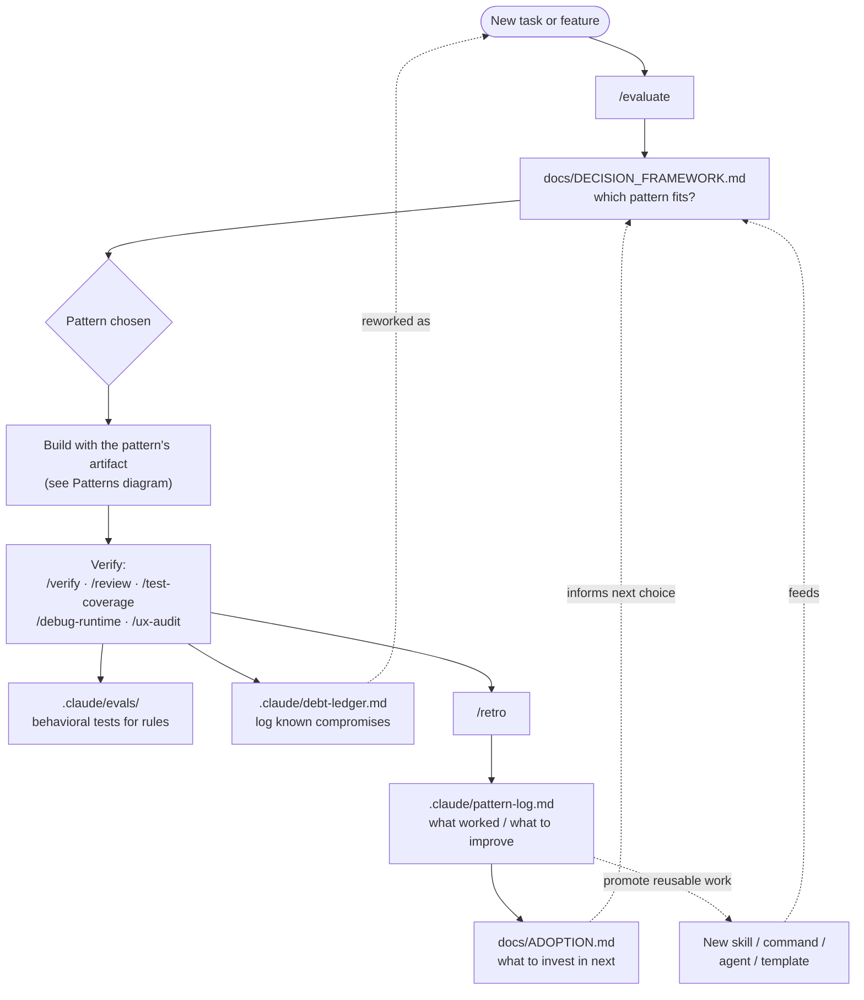
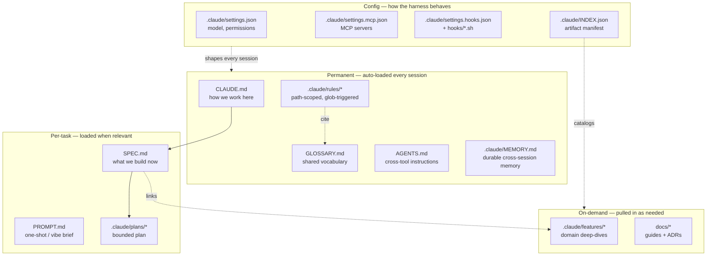
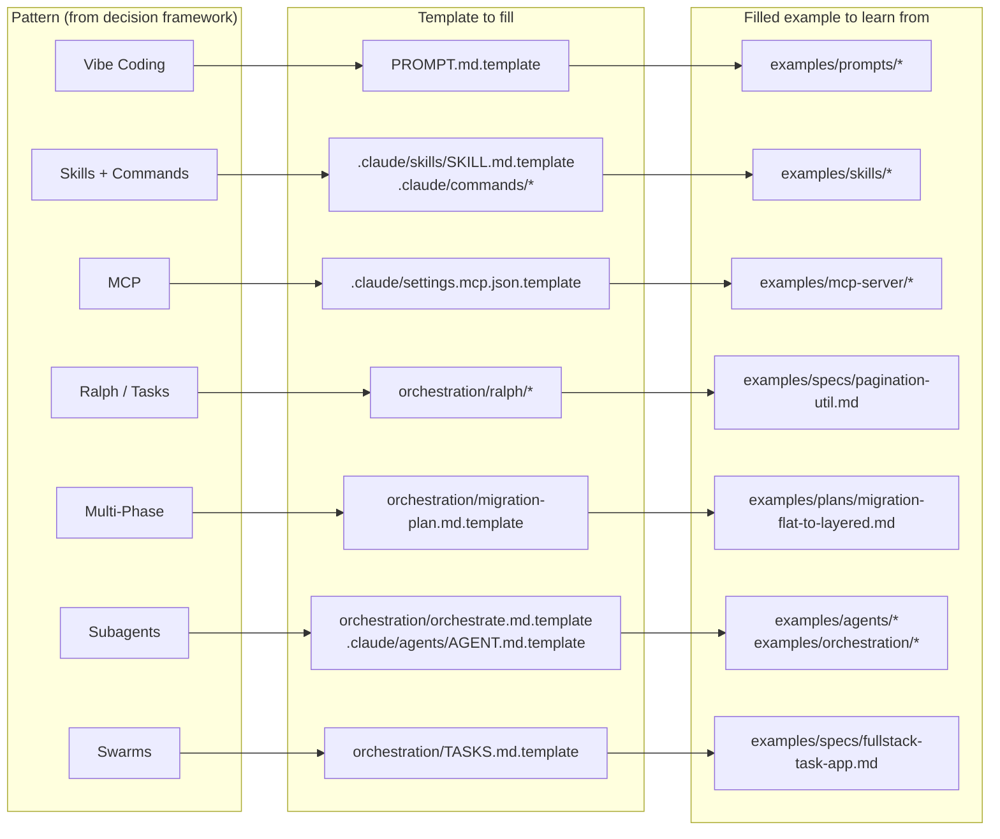
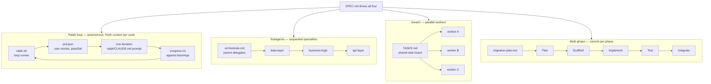
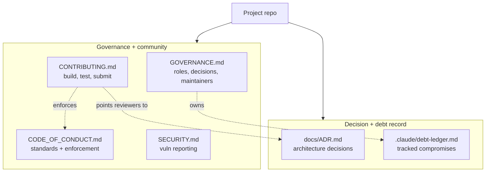

# How Anvil Fits Together

Anvil isn't a stack you install top-to-bottom — it's a set of pieces that snap
together around one loop: **decide → build → verify → learn**. These five
diagrams show the pieces and how they connect. Start with the workflow loop; the
rest zoom into one region of it.

- [1. The workflow loop](#1-the-workflow-loop) — the cycle every task runs through
- [2. Context layers](#2-context-layers) — what Claude reads, and when
- [3. Patterns → templates → examples](#3-patterns--templates--examples) — pick a pattern, fill a template, learn from an example
- [4. Orchestration internals](#4-orchestration-internals) — how the four multi-step patterns actually run
- [5. Project scaffolding](#5-project-scaffolding) — governance, community, and decision records

---

## 1. The workflow loop

Every task enters through `/evaluate`, which routes to a pattern via the
decision framework. You build, verify, and retro — and the retro feeds a
pattern-log that, over time, tunes which pattern you reach for next. Debt and
promotable work loop back to the top.

---

## 2. Context layers

Not everything loads at once. `CLAUDE.md` and rules are read every session;
`SPEC.md` and plans come in per task; features and docs are pulled on demand;
config shapes how the whole harness behaves.

---

## 3. Patterns → templates → examples

Each pattern from the decision framework has a template you fill and a filled
example you can read first. Same three-column shape across all of them.

---

## 4. Orchestration internals

The four multi-step patterns each have a distinct shape: Ralph loops on itself,
subagents run in sequence, swarms fan out in parallel, and multi-phase commits
at each stage. `SPEC.md` drives all four.

---

## 5. Project scaffolding

The non-AI files that make a repo a healthy project: who decides, how to
contribute, how to behave, how to report a vuln — plus the running record of
decisions (ADRs) and known compromises (debt ledger).

